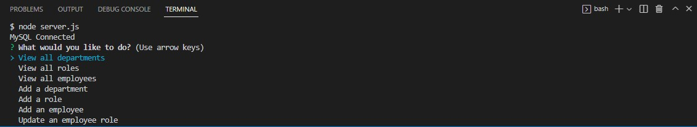

# Employee-Tracker  

## Back-end application that allows user to navigate and view the different departments, roles, and employees in a given database

  
[Demo Video]()  

### Used 'node' to run application, 'express' for the server, 'inquirer' for prompts, and 'mysql' for database management.